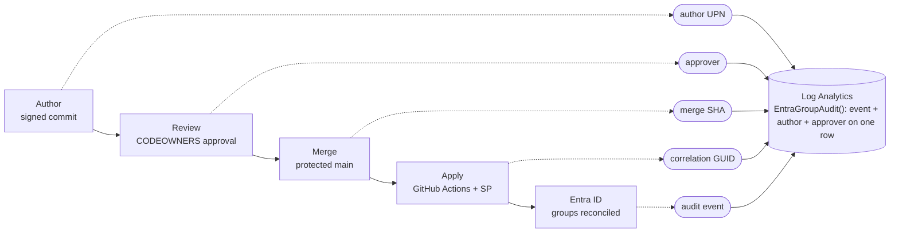
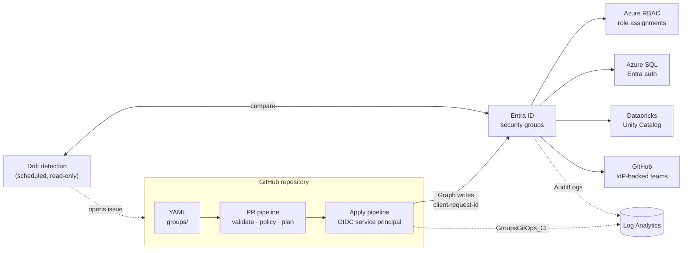
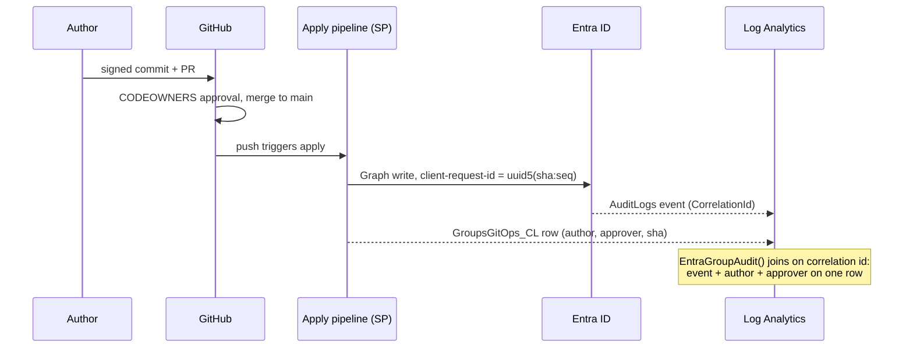

# HLD: entra-group-management

This project's near-term job is the **initial build-out**: standing up the full set of Entra ID security groups and memberships needed to put RBAC in place across Azure, Azure SQL, Databricks, and GitHub, then keeping them maintained. The mechanics stay deliberately simple — one YAML file per group, changed by pull request, applied by one GitHub Actions pipeline. No portal, no middleware, no intake automation until the volume justifies it. Audit attribution to the human who made each change is preserved by correlation between the Git history and the Entra audit log.

- **Status:** Draft v0.1
- **Owner:** Graham Lammers
- **Date:** 2026-08-07

---

## 1. Goal

One sentence: every Entra security group and its membership is declared in versioned YAML, changed only through pull requests, applied automatically by CI, and traceable end to end from an Entra audit log entry back to the commit and the human who authored and approved it.

### 1.1 Justification and benefits

- **Single system of record.** One repo answers "who has access to what, who approved it, and why" across Azure RBAC, Azure SQL, Databricks, and GitHub, instead of four portals with four partial views.
- **Audit-ready by construction.** Every access change has an author, an approver, and an Entra audit event joined on one row; standing evidence for SOX / SOC 2 / ISO 27001 access-control requirements with zero manual evidence gathering.
- **Reviewed, versioned, reversible.** Git history is the access-change ledger; rollback is `git revert`, not archaeology in the portal.
- **Discipline enforced, not requested.** Naming convention, mandatory owners, and review are pipeline gates, so group sprawl and orphan groups cannot merge.
- **Scalable intake.** Issue form to scaffolded PR to merge; access requests stop bottlenecking on whoever holds the admin role.

## 2. Audit attribution

Every Entra audit event for a managed group carries the committing user. Auditors query one KQL function, `EntraGroupAudit()`, and get the Entra event with `commitAuthorUpn` and `approver` on the same row (mechanism in section 4.6).



| Control | What it records |
|---|---|
| Required signed commits + branch protection on `main` | Who authored the change, cryptographically |
| Required PR review via CODEOWNERS | Who approved the change |
| GitHub environment approval gate on the apply job | Who released the change (optional second gate for prod) |
| `client-request-id` on every Graph write: GUID derived from the commit SHA | Keys each Entra audit log entry (`CorrelationId`) to the exact commit |
| `GroupsGitOps_CL` row per Graph write in the same Log Analytics workspace as `AuditLogs` | Commit author UPN, approver, commit SHA, run URL, joined to the Entra event |

## 3. Recommendation

Custom reconciler (Python 3.12+, Pydantic, Microsoft Graph SDK) driven by YAML, applied via GitHub Actions with OIDC. Full control of the schema, plan/apply UX, policy checks, and the correlation-id stamping that makes the audit story work. Sample group and policy files live under `samples/` in this folder.

## 4. Architecture



### 4.1 Repository layout

```
entra-group-management/
├── groups/
│   ├── azure/            # groups consumed by Azure RBAC role assignments
│   ├── azure-sql/        # groups mapped into Azure SQL databases
│   ├── databricks/       # groups consumed by Databricks / Unity Catalog
│   └── github/           # groups mapped to GitHub teams
├── schema/
│   └── group.schema.json # generated from the Pydantic model, used by IDEs
├── policy/
│   ├── protected-groups.yaml   # denylist the reconciler may never touch
│   └── naming.yaml             # naming convention rules
├── src/                  # reconciler (Python 3.12+, Pydantic, msgraph-sdk)
├── tests/
└── .github/workflows/
    ├── pr-validate.yml   # on: pull_request
    ├── apply.yml         # on: push to main
    └── drift.yml         # on: schedule (daily)
```

### 4.2 Group YAML schema

One file per group. Filename equals group name.

```yaml
# groups/databricks/grp-data-databricks-bi_analyst-prod.yaml
name: grp-data-databricks-bi_analyst-prod
description: "Read access to prod gold schemas in Unity Catalog"
owners:                      # Entra group owners, min 1, enforced by schema
  - alice@rubicon.com
members:
  users:
    - bob@rubicon.com
    - carol@rubicon.com
  groups:                    # nested groups allowed, must also exist in repo
    - grp-data-core-team
targets:                     # where this group is consumed; drives docs and checks
  - databricks
metadata:
  domain: data
  environment: prod
  requested_in: "https://github.com/org/repo/issues/42"
```

Schema is a Pydantic model (`Field(min_length=1)` on owners, enum on targets, regex on name). Absent optional fields fail loudly, never default silently.

### 4.3 PR validation pipeline (`pr-validate.yml`)

1. **Schema validation.** Every changed YAML parses into the Pydantic model. Fail on unknown keys.
2. **Policy checks.**
   - Name matches `grp-<domain>-<service>-<role>-<env>` (see section 6.3).
   - Group not on the protected list (`policy/protected-groups.yaml`).
   - No role-assignable groups (explicitly out of scope, see risks).
   - Every member UPN resolves in Entra (read-only Graph call).
   - Nested member groups exist in the repo.
3. **Plan.** Read-only Graph comparison, post the diff (creates, deletes, member adds/removes) as a PR comment so reviewers approve the *effect*, not just the text.

### 4.4 Apply pipeline (`apply.yml`)

1. Trigger: push to `main` (i.e., merged PR). Branch protection requires signed commits and CODEOWNERS review, so a push implies an identified author and approver.
2. Auth: GitHub OIDC federated credential on an Entra app registration. No stored secrets.
3. Reconcile, idempotent, in dependency order (nested groups first):
   - Create groups present in YAML, absent in Entra.
   - Update description/owners.
   - Sync membership **authoritatively**: repo wins, out-of-band additions are removed.
   - Delete groups removed from YAML, gated by a `deletions-approved` label check on the source PR.
4. Every Graph write sends `client-request-id: uuid5(NAMESPACE, "<commit-sha>:<seq>")`. Graph requires a GUID here, so the commit SHA cannot be sent verbatim; UUIDv5 with a fixed project namespace makes the GUID deterministic, so anyone holding only the commit SHA can recompute every correlation id, and anyone holding a correlation id can match it against candidate commits.
5. Emit one structured audit record per Graph write (JSON: correlation GUID, commit SHA, commit author UPN, PR number, approver, run URL, operation, target group) to Log Analytics via a data collection rule, custom table `GroupsGitOps_CL`.

### 4.5 Drift detection (`drift.yml`)

Daily scheduled run, read-only. Compares Entra state to YAML for all managed groups. On drift: opens a GitHub issue with the diff and tags the group owners. It does **not** auto-revert; a human decides whether to codify the change (PR adding it) or let the next apply run remove it. Rationale: auto-revert on a schedule creates silent tug-of-war with whoever made the portal change; an issue creates a conversation.

### 4.6 Audit enrichment: putting the commit user next to the Entra event

Goal: an auditor querying the Entra audit logs sees the committing user on every managed-group event without leaving the workspace.



1. **Diagnostic settings** on the Entra tenant stream `AuditLogs` to a Log Analytics workspace. Retention set to the compliance requirement (e.g., 2 years); Entra's own portal retention is only 30 days and is not sufficient on its own.
2. The apply pipeline writes `GroupsGitOps_CL` to the **same workspace**, one row per Graph write, keyed by the correlation GUID (section 4.4), carrying `commitSha`, `commitAuthorUpn`, `prNumber`, `approverLogin`, `runUrl`.
3. A saved KQL function is the auditor's entry point:

```kusto
// EntraGroupAudit() - Entra audit events for managed groups, enriched with the human
AuditLogs
| where Category == "GroupManagement"
| join kind=leftouter (GroupsGitOps_CL) on $left.CorrelationId == $right.correlationGuid_g
| project TimeGenerated, OperationName, TargetResources,
          entraActor = InitiatedBy,            // the SP
          commitAuthorUpn_s, approverLogin_s, commitSha_s, runUrl_s
```

Rows with an empty `commitAuthorUpn_s` are changes that did **not** come from the pipeline: that null column is itself the out-of-band-change detector and feeds the same alerting as drift detection.

Two conditions make the join trustworthy:

- **Commit email must resolve to an Entra UPN.** Enforced in PR validation: the commit author email is looked up in Entra (or via GitHub SAML/EMU identity mapping) and the PR fails if it does not resolve. No `users.noreply.github.com` emails on this repo.
- **`client-request-id` propagation to `AuditLogs.CorrelationId` is load-bearing and must be proven in V1**, not assumed. If a Graph write path turns out not to propagate it, the fallback join is timestamp + target group + actor SP within the apply window, which is weaker; treat that as a blocker to resolve before V1 sign-off.

## 5. Identity, permissions, blast radius

| Principal | Permission | Scope note |
|---|---|---|
| Apply SP | Entra role **Groups Administrator**, scoped to an **Administrative Unit** containing only managed groups | Preferred over the Graph app permission `Group.ReadWrite.All`, which is tenant-wide and unscoped |
| PR/drift SP (separate app) | `Group.Read.All`, `User.Read.All` (application, read-only) | Plans and drift never need write |

Sharp edges:

- If AU-scoped roles are not feasible in your tenant, `Group.ReadWrite.All` is the fallback and its blast radius is the whole tenant. The protected-groups denylist and the "reconciler only touches groups matching the naming prefix `grp-`" guard become the only fences. Both are code-level controls, not platform controls. Flag this to security review.
- Role-assignable groups require `RoleManagement.ReadWrite.Directory` and can grant Entra roles. Excluded from scope; the schema rejects `isAssignableToRole`.
- Two SPs (read vs write) so a compromised PR from a fork can never hold a write token. Apply workflow additionally restricted with `environment:` protection.

## 6. Process: identifying the groups you need

This is the intake methodology for building the initial YAML corpus and for evaluating new requests.

### 6.1 Inventory (discover what exists)

| Surface | How to enumerate |
|---|---|
| Azure RBAC | `az role assignment list --all` per subscription; extract principals that are users (candidates to replace with groups) and existing groups |
| Azure SQL | Query `sys.database_principals WHERE type IN ('E','X')` per database (`E` = Entra user, `X` = Entra group) |
| Databricks | `databricks account groups list` (account-level) and per-workspace `databricks groups list` to find workspace-local groups that need migration to account groups |
| GitHub | Org teams + members via `gh api /orgs/<org>/teams`; note which are IdP-synced already |
| Entra | Existing security groups with direct resource assignments |

Output: a spreadsheet of (principal, resource, permission) triples. Every **user** appearing directly in a resource ACL is a finding to remediate into a group.

### 6.2 Access modeling (derive the group set)

Build a matrix of **persona x resource scope x access level x environment**. One group per cell that has members. Rules:

1. No direct user grants on resources. Users go in groups; groups get grants.
2. One group per permission boundary, not per team. A team needing reader on nonprod and writer on prod is two groups.
3. Nest where a real hierarchy exists (`grp-data-core-team` inside several access groups) so joiners/leavers are one membership change.
4. If two groups would always have identical membership, they are one group.

### 6.3 Naming convention

```
grp-<domain>-<service>-<role>-<env>
```

Examples: `grp-data-databricks-bi_analyst-prod`, `grp-platform-azsql-admin-nonprod`, `grp-engineering-github-engineer-prod`. The regex is enforced in the PR pipeline; the `grp-` prefix doubles as the reconciler's ownership fence.

### 6.4 Per-service group patterns

**Azure (RBAC)**
- One group per (role, scope, env), assigned via `az role assignment` or IaC. Typical: Reader at subscription, Contributor at resource group.
- Privileged roles (Owner, User Access Administrator) go through PIM with the group as *eligible*, not active. PIM-eligible assignment is out of scope for v1 (see non-goals); the group itself is still managed here.

**Azure SQL**
- Server must have an Entra admin set. Each group is added per database: `CREATE USER [grp-...] FROM EXTERNAL PROVIDER;` then `ALTER ROLE db_datareader ADD MEMBER [grp-...];`.
- Standard trio per database per env: reader, writer, admin.
- Sharp edge: group membership changes take effect on the user's **next login/token**, not instantly. Removal from a group does not kill live sessions.

**Databricks**
- Use **account-level groups only**. Workspace-local groups do not work with Unity Catalog grants across workspaces; existing ones get migrated during inventory.
- Preferred sync: **automatic identity management** (Entra groups become usable in Databricks directly, no SCIM app to maintain). Fallback: the Entra SCIM provisioning app to the account. Either way, this repo manages the Entra side; Databricks consumes.
- Grant Unity Catalog privileges (`USE CATALOG`, `SELECT`, etc.) and workspace assignment to groups, never to individual users. Typical set per data domain per env: bi_analyst (read gold), data_engineer (read/write silver+gold), admin.

**GitHub**
- Requires GitHub Enterprise Cloud with Entra-backed SSO. With **Enterprise Managed Users**, Entra groups map to GitHub teams natively; with classic + team sync, each team links to one Entra group.
- Repo permissions go to teams, teams are IdP-backed, so this repo's membership change propagates to repo access. Typical: `read`, `write`, `maintain` team per repo cluster.

### 6.5 Ongoing intake

Near term, group requests keep arriving as Zendesk tickets — no process change for requesters. The admin team fulfills each ticket as a PR (ticket URL in `metadata.requested_in`) instead of a portal edit; the Zendesk approval is context, the CODEOWNERS review is the enforced gate. Automating this bridge is phase 3 (section 9). CODEOWNERS routes review: `groups/databricks/` to the data platform team, `groups/azure/` to the platform team, `policy/` to security. Decommission is a PR deleting the file plus the `deletions-approved` label.

## 7. Non-goals (v1)

- User lifecycle (joiner/mover/leaver). That belongs to HR-driven provisioning in Entra, not this repo.
- PIM eligible/active assignment management.
- App registrations, service principals, Entra roles.
- The downstream grants themselves (Azure role assignments, SQL `CREATE USER`, UC `GRANT`). This repo makes the groups exist and be correct; wiring grants is each platform's IaC. A v2 could close that loop.

## 8. Risks and failure modes

| Risk | Impact | Mitigation |
|---|---|---|
| Authoritative sync removes an out-of-band emergency addition | Access loss mid-incident | Drift detection issues instead of auto-revert; break-glass groups on the protected list |
| SP write scope too broad (no AU) | Tenant-wide blast radius on compromise | AU scoping (5); prefix fence + protected list in code; separate read/write SPs; environment-gated apply |
| Group deletion cascades (SQL users orphaned, UC grants dangling, GitHub teams unlinked) | Broken downstream references | Deletion gate label; plan output lists targets from `metadata`; 30-day soft-delete window in Entra allows restore |
| Unsigned or unreviewed commit reaches main | Attribution chain broken | Branch protection: signed commits, CODEOWNERS review, no force push, no direct push |
| Graph throttling on large membership syncs | Partial apply | Batch with `$batch`, exponential backoff, idempotent re-run; apply is safe to retry |
| Two applies race (merge queue off) | Conflicting writes | GitHub concurrency group on the apply workflow, `cancel-in-progress: false` |

## 9. Delivery plan

Scope commitment: this project delivers the **one-time build-out** and the **near-term maintenance loop**. Intake automation is deliberately deferred (see phase 3) — manual ticket-to-PR conversion during phases 1 and 2 is how the schema, naming vocabulary, and review flow get validated before anything is automated on top of them.

1. **Phase 1 — build the loop (V1):** schema + validation + apply for one folder (`groups/databricks/`), correlation-id stamping, audit record to Log Analytics, branch protections on. Databricks first because automatic identity management makes consumption zero-config.
2. **Phase 2 — build-out and run state:** the access matrix (6.2) becomes the initial group corpus as PRs across all folders; drift detection and deletion gating turn on. Maintenance model: users keep filing Zendesk tickets as today; the admin team fulfills them as PRs (ticket URL in `metadata.requested_in`) instead of portal clicks. Requesters see no process change.
3. **Phase 3 — suggested, not committed:** Zendesk intake automation (ticket-form webhook -> `repository_dispatch` -> scaffolded PR, with status written back to the ticket). Trigger for building it: ticket-to-PR conversion has become mechanical and frequent enough that the field mapping is obvious from real tickets. Also in this horizon: downstream grant automation (UC grants, SQL scripts, GitHub team mapping) or handoff contracts to each platform's IaC.

## 10. Validation criteria (definition of done for V1)

- A membership change PR merged by user X produces an Entra audit entry that, via the `EntraGroupAudit()` function, shows X as `commitAuthorUpn` and Y as approver on the same row as the Entra event. Demonstrated end to end to an auditor with a single KQL query.
- The `client-request-id` -> `AuditLogs.CorrelationId` propagation is verified against real Graph writes (create group, add member, remove member) before any other V1 work is called done.
- Re-running apply on an unchanged repo produces zero Graph writes (idempotency).
- A manual portal edit to a managed group is surfaced by the next drift run within 24h.
- A PR touching a protected group fails validation and cannot merge.
- Eval-style regression suite: fixture YAML sets with known-correct plans (create, delete, member add/remove, nested group, invalid UPN, protected group) run on every PR to the reconciler code.
