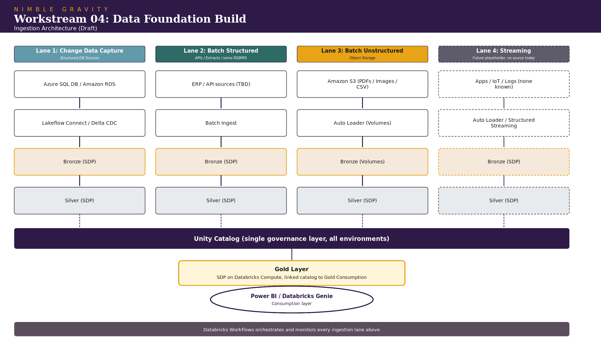

**NIMBLE GRAVITY**

Rubicon Technologies Transformation Program

**Workstream 04: Data Foundation Build**

*Architecture & Implementation Plan (Draft for Review)*

| **Document Control**    |                                                                                                               |
|-------------------------|---------------------------------------------------------------------------------------------------------------|
| **Program**             | Rubicon Technologies Transformation Program                                                                   |
| **Client**              | Rubicon Global, LLC                                                                                           |
| **Workstream**          | 04: Data Foundation Build                                                                                     |
| **Nimble Gravity Lead** | Dave Newman                                                                                                   |
| **Client Counterpart**  | Graham Lammers, Sr. Director, Data                                                                            |
| **Governing agreement** | Statement of Work: Data Foundation Build, under the Master Professional Services Agreement dated June 9, 2026 |
| **Document status**     | Draft for review, prepared August 6, 2026                                                                     |

# **1. Purpose and Scope**

This document sets out the proposed architecture for Rubicon's data
foundation and the build approach for Workstream 04, as scoped in the
Data Foundation Build SOW. It covers the target lakehouse architecture,
ingestion design, environment topology, governance model, and delivery
approach.

A number of decisions here depend on information that will only be
confirmed at kickoff or shortly thereafter, most notably the full source
system inventory and priority sequencing.

See the companion BRD/Tech Spec for the full workstream picture.

# **2. Architecture Principles**

The target platform is a Databricks lakehouse on Azure, built around
four principles:

- **Metadata-driven pipelines.** Ingestion and transformation logic is
  configuration as opposed to hand-written code per source. New sources
  are onboarded by adding metadata, not by writing a new pipeline.

- **Medallion architecture.** Bronze, silver, and gold layers, with
  transformations built using Spark Declarative Pipelines (SDP) rather
  than hand-rolled notebooks or jobs. In practice, this principle
  applies insofar as the source system allows it for bronze
  ingestion/landing, but will apply uniformly for silver and gold.

- **Unity Catalog as the single governance layer.** All bronze, silver,
  and gold assets (including any unstructured data, should that be
  required in the future) are registered in Unity Catalog. No external
  data or metastore catalog is in scope for this build.

- **Infrastructure and deployment as code.** Databricks Asset Bundles
  (DABs) manage workflow, pipeline, and job deployment across
  environments. Environment provisioning is scripted, not manual.

# **3. Source Systems and Ingestion Architecture**

## **3.1 Known sources (as of 8.6.26)**

- Azure SQL Database

- Amazon RDS (one or more instances, subject to confirmation)

- Amazon S3 (unconfirmed, requires more investigation into Palantir
  Foundry deployment)

The full source inventory, including where GUS and other operational
systems fit, is **to be determined at or shortly after kickoff**. The
architecture below is designed so additional sources slot into an
existing lane rather than requiring new patterns.

## **3.2 Ingestion lanes**

Notes on the lanes:

- **Lane 1 (CDC)** uses Databricks-native change data capture, either
  Lakeflow Connect where a managed connector exists for the source, or
  Delta Change Data Feed / Auto Loader patterns built on top of a
  replication landing zone. No third-party CDC or ETL vendor tooling is
  assumed.

- **Lane 2 (batch structured)** covers API and extract-based sources.
  This lane is a placeholder pattern until the kickoff source list
  clarifies which systems fall here versus Lane 1.

- **Lane 3 (batch unstructured)** ingests directly from object storage
  (ADLS/S3/etc.) into Databricks-managed Volumes using Auto Loader,
  avoiding a separate ADLS landing hop where the source is already
  object storage.

- **Lane 4 (streaming)** is designed but not built in this phase. No
  streaming source has been identified. Its purpose is to confirm the
  pattern extends cleanly if one emerges later, not to justify build
  effort now.

# **4. Environment and Platform Topology**

- **Azure tenant:** single tenant. Rubicon's current Azure footprint is
  immature, and a single-tenant model keeps identity and access
  management manageable and follows best practice.

- **Subscriptions:** one subscription per environment (dev, test, prod
  or similar naming convention), providing hard isolation on cost,
  quota, and access boundaries between environments. These subscriptions
  do not exist today and will be created as part of this workstream.

- **Databricks workspaces:** one workspace per environment, matching the
  subscription boundaries. No shared workspace across dev/test/prod.
  Databricks default catalog is bound per environment/workspace so
  deployment doesn't require code changes.

- **Networking and landing zones:** to be designed alongside
  subscription setup. Given Rubicon's current primary hyperscaler is AWS
  (see Section 8, dependency on documented AWS/Terraform handoff), this
  includes defining how data lands from AWS sources into Azure as well
  as how it moves once inside Azure.

# **5. Governance**

Unity Catalog is the system of record for governance across all three
layers (bronze, silver, gold). This includes:

- Catalog and schema structure aligned to environment and, within an
  environment, to data domain/product/medallion layer (to be agreed upon
  during planning)

- Access control (grants) managed as code

- Lineage and audit captured natively through Unity Catalog rather than
  a separate metadata tool

No external data catalog is in scope for this build.

# **6. CI/CD and Infrastructure as Code**

- **Source control:** GitHub, which Rubicon already uses. Whether
  Rubicon chooses to create a new GitHub organization for this project,
  and whether Rubicon currently supports GitHub OIDC, is to be
  determined.

- **Service principals:** Rubicon does not currently have service
  principals configured for automated deployment. This workstream will
  propose and provision service principals scoped separately for CI/CD
  pipelines, infrastructure-as-code (Terraform \[preferred\] or
  equivalent for Azure resource provisioning), and Databricks workload
  identity, following least-privilege boundaries per environment.

- **Deployment mechanism:** Declarative Automation Bundles, driving
  deployment of jobs, pipelines, and workflow definitions across dev,
  test, and prod from GitHub Actions (or Rubicon's preferred CI runner,
  to confirm).

- **Dependency:** none of this can be finalized until the
  subscription-per-environment topology (Section 4) and the AWS
  environment handoff (Section 8) are resolved, since both affect what
  the service principals need access to.

# **7. Consumption and Reporting Layer**

- **Primary consumption:** Power BI, connecting to gold-layer marts via
  Databricks SQL, ideally through OneLake mirroring.

- **Secondary/emerging consumption:** Databricks Genie and other
  AI-native, natural-language query tooling are expected to be used
  against the gold layer as the platform matures. The gold layer and
  Unity Catalog metadata will be designed with that consumption pattern
  in mind (clear table and column naming, documented business
  definitions, governed tags) rather than treating Power BI as the only
  downstream consumer.

- Per the SOW, dashboard and report build itself is out of scope for
  this workstream beyond what's needed to validate the foundation; that
  work sits with the Reporting Certification + Cutover workstream
  (WS03).

# **8. Dependencies, Assumptions, and Risks**

| **Item**                                      | **Detail**                                                                                                                                                                                                                           | **Rationale**                                                                                                                                                                                         |
|-----------------------------------------------|--------------------------------------------------------------------------------------------------------------------------------------------------------------------------------------------------------------------------------------|-------------------------------------------------------------------------------------------------------------------------------------------------------------------------------------------------------|
| AWS environment handoff                       | Rubicon's current infrastructure knowledge (AWS, Terraform) sits primarily with Rackspace, who are exiting the account. Program-level guardrails call for a documented environment handoff before any Azure migration step proceeds. | Without this, the team is migrating off infrastructure nobody at Rubicon or Nimble Gravity can fully account for. This is a prerequisite for Section 4 and Section 6 work, not a parallel workstream. |
| Full source inventory                         | Only Azure SQL DB, RDS, and S3 are confirmed today. GUS and other operational systems are not yet mapped to a lane.                                                                                                                  | Confirmed at kickoff or quickly following; the lane design in Section 3 is built to absorb this without a redesign, but sequencing and effort estimates depend on it.                                 |
| Priority sequencing                           | Which sources get built first within the Build phase (Months 1-4) is a live open item for kickoff.                                                                                                                                   | Determines the actual build order; not addressed in this document (see Section 9).                                                                                                                    |
| Azure subscription and workspace provisioning | Does not exist today; must be stood up as part of this workstream.                                                                                                                                                                   | Gates all environment-specific work, including CI/CD service principal scoping.                                                                                                                       |
| Certification tolerances                      | Data quality and reconciliation tolerance thresholds are not yet defined.                                                                                                                                                            | Per the SOW, these are defined in collaboration with Rubicon's business users during the Build/Certify transition, not set unilaterally by Nimble Gravity.                                            |
| Streaming lane                                | No streaming source identified.                                                                                                                                                                                                      | Architected as a placeholder only for potential future source systems. Does not affect the initial architecture.                                                                                      |

# **9. Roadmap**

The SOW defines three phases:

| **Phase** | **Focus**                                                      | **Estimated Timing** |
|-----------|----------------------------------------------------------------|----------------------|
| Build     | Lakehouse setup, ETL pipeline development, source integration  | Months 1-4           |
| Certify   | Data quality validation, reconciliation against source systems | Months 4-5           |
| Stabilize | Performance tuning, monitoring, handoff to run-state support   | Month 6              |

Sequencing within the Build phase, specifically which sources and lanes
get built in what order, is a live open item for kickoff and is
intentionally not detailed here. Once the source inventory and
priorities are confirmed, this section should be expanded into a
phase-level plan (not sprint-level) covering source onboarding order,
environment/subscription buildout milestones, and governance rollout.

# **10. Open Decisions for Kickoff**

- Full source system inventory, including GUS and any other operational
  or reporting systems

- Priority sequence for source onboarding within the Build phase

- CI runner choice for CI/CD (GitHub Actions vs. alternative)

- Terraform (or equivalent) ownership and standards for Azure IaC, given
  the AWS/Terraform handoff dependency

- Data quality tolerance thresholds and the business stakeholders who
  will co-define them
